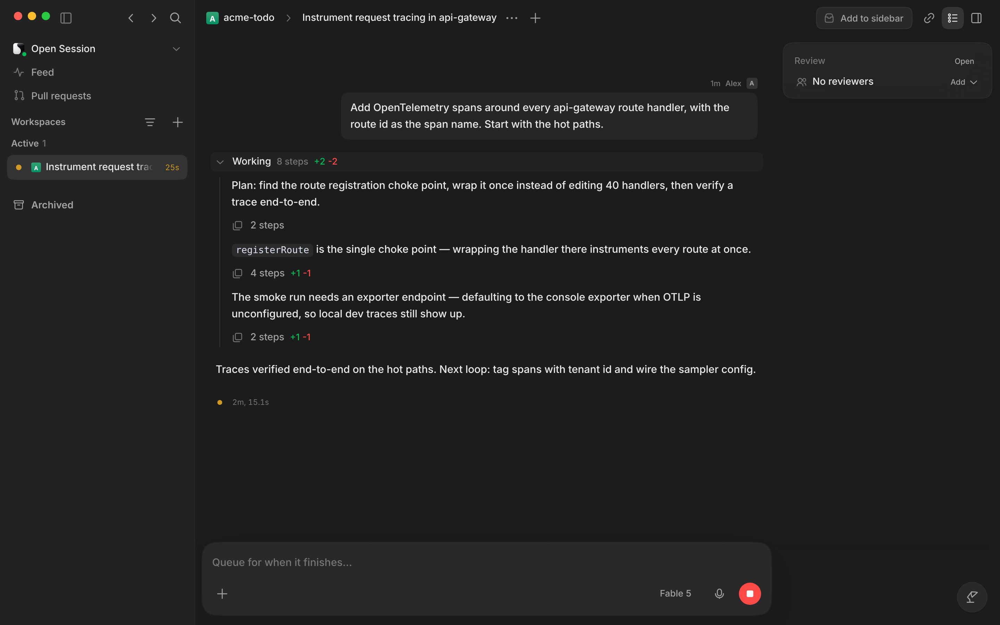
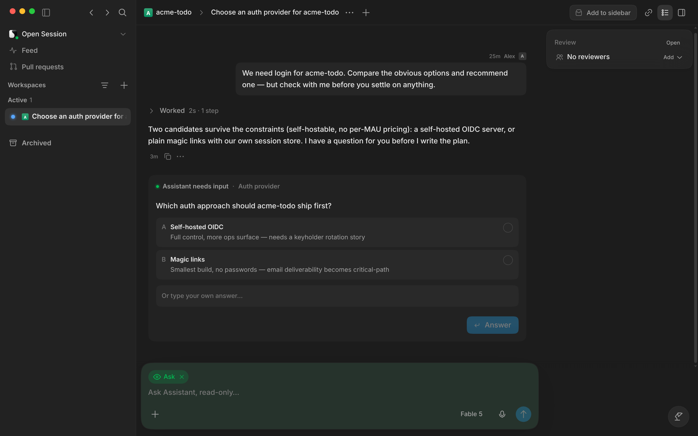
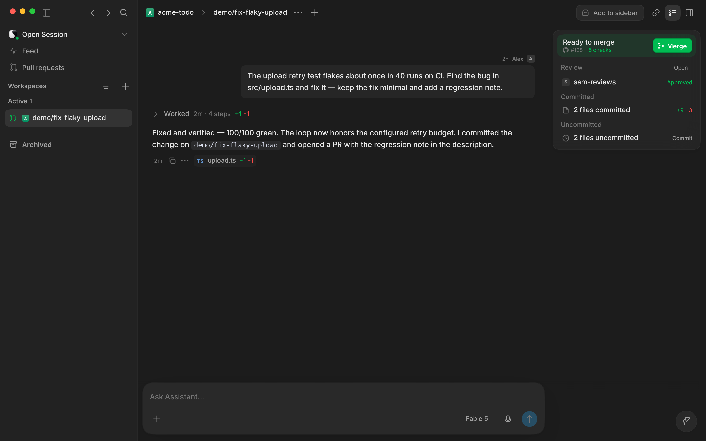
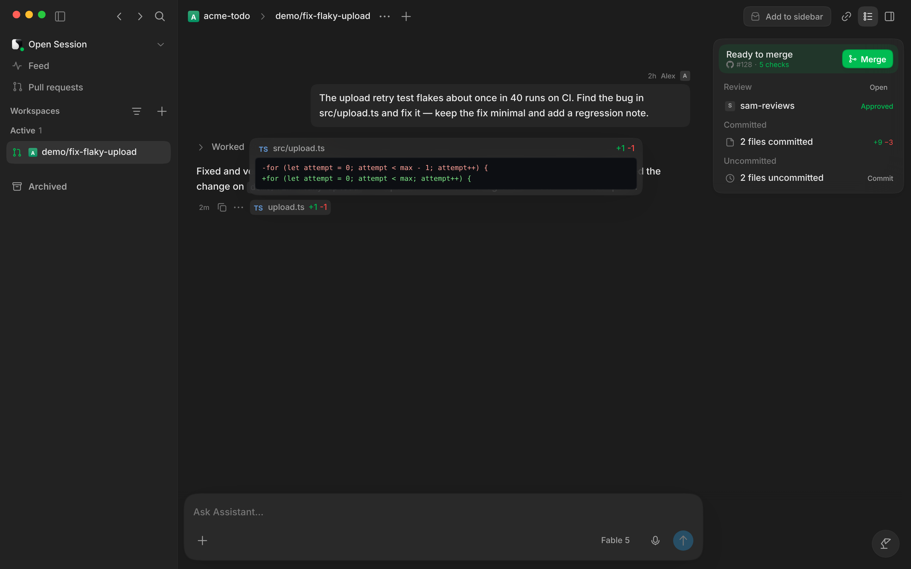
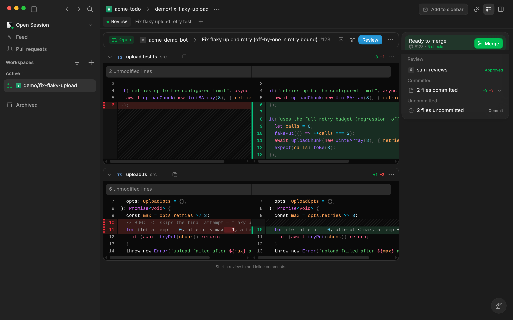
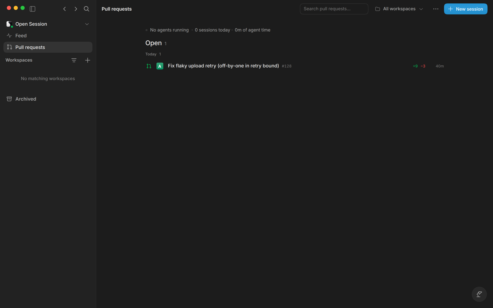
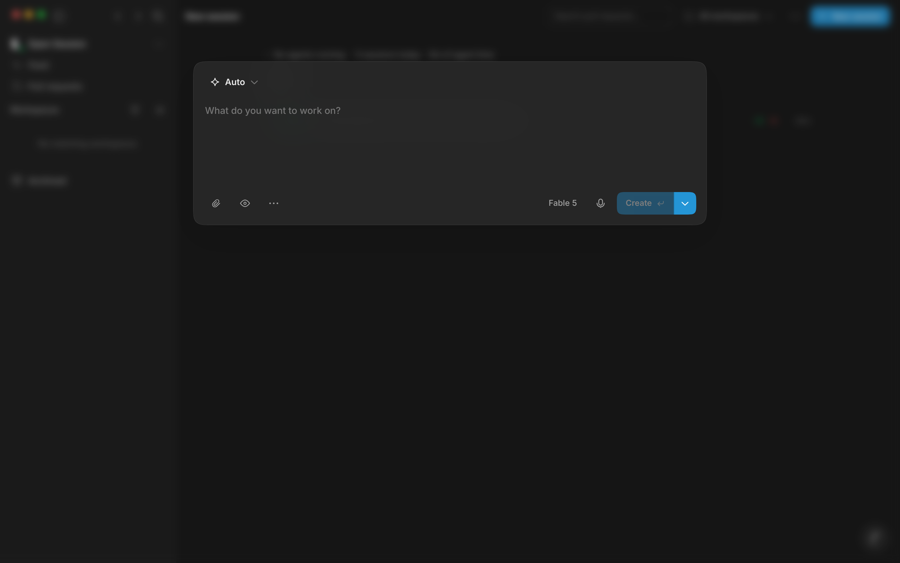
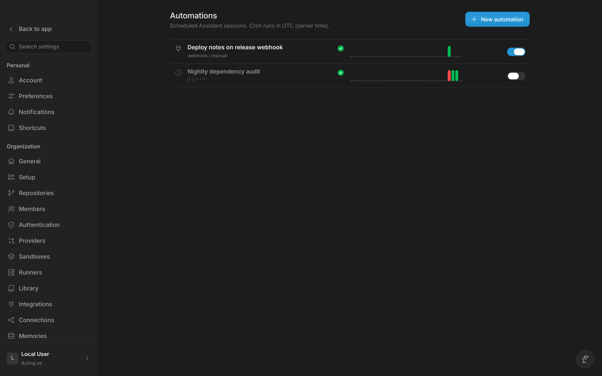
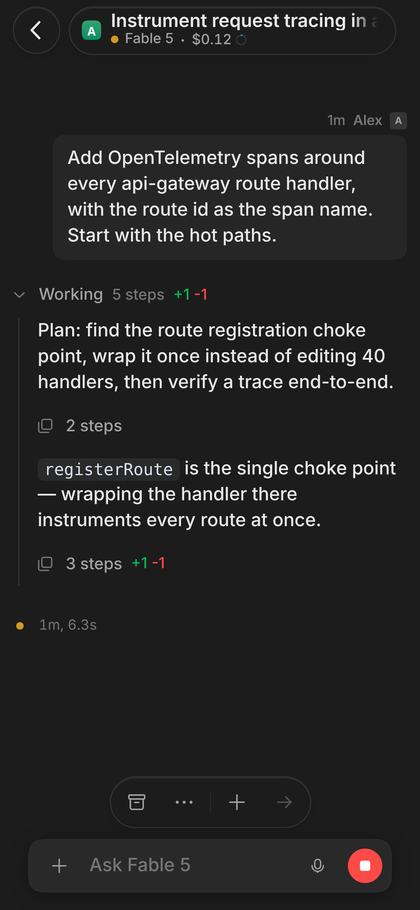

# Screenshots

All were captured from the isolated demo instance described in
[Self-development](self-development.md). It runs with `OPENSESSION_DEV=1`,
`OPENSESSION_DEMO=1` and an isolated `OPENSESSION_STATE_DIR`. Everything in
frame is synthetic: fictional teammates, a fictional `acme-todo` repo and a
fictional PR #128.

## A session, mid-run

The transcript streams as the agent works: plans, tool calls, commands and
recovery. The composer can queue your next prompt behind the running turn.

## When the agent needs you

A question pauses the run and surfaces as a card. Pick an option or write your
own answer, and the turn continues.

## The work it produced

Repository-backed sessions show their branch and working-tree status. When a
PR exists, the workspace also shows its merge state, review and changed files.

## Changes

Open a file chip to see exactly what a turn changed, inline with the transcript
that produced it.

## Reviewing the pull request

The review surface combines a split diff with the PR status, checks, reviewer
approval and merge action.

## Pull requests

Pull requests across your repos, with search and workspace filters. The sidebar
keeps active workspaces close by.

## Starting work

Choose a mode and model, then describe the job. Start from a current workspace
or create a new one.

## Automations

Scheduled and webhook-triggered agent runs, each with its own history.

## On a phone

The same UI, installed as a PWA. Read a running session and steer it from
anywhere.

